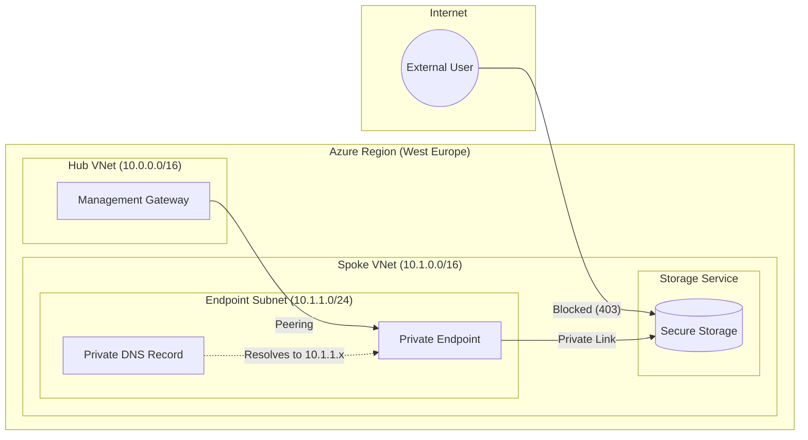

Azure Secure Storage Enclave
Overview

This project implements a Zero-Trust Network Architecture to secure an Azure Storage Account. The primary objective is to ensure that sensitive data is completely isolated from the public internet and accessible only via verified, internal network paths.

Using Terraform, this repository automates the deployment of a Hub-and-Spoke topology, Private Link integration, and a private DNS strategy.



## 🏗️ Architecture Highlights

The infrastructure is built on the following core components:

* **Hub-and-Spoke VNet Topology:** Logical separation between the management network (**Hub**) and the resource-hosting network (**Spoke**).
* **Virtual Network Peering:** Enables low-latency, private routing between the two networks without traversing the public internet.
* **Private Endpoint:** Assigns a dedicated private IP address from the Spoke subnet to the Storage Account.
* **Private DNS Zone:** Implements internal name resolution so that `blob.core.windows.net` requests stay within the Azure backbone.
* **Network Firewall (Stateless):** The Storage Account is configured with `default_action = "Deny"`, effectively "blackholing" all unauthorized external traffic.

---

## 🛠️ Technical Specifications

| Category | Specification |
| :--- | :--- |
| **Infrastructure as Code** | Terraform (AzureRM Provider ~> 3.0) |
| **Storage Tier** | Standard with LRS (Locally Redundant Storage) |
| **Security Posture** | Public Network Access Disabled; Shared Key Access Enabled |
| **DNS Resolution** | Private DNS Zone for `privatelink.blob.core.windows.net` |
| **Address Space** | Hub (10.0.0.0/16) & Spoke (10.1.0.0/16) |

---

## 🚀 Getting Started

### Prerequisites
* An active **Azure Subscription**.
* **Terraform CLI** installed.
* Authenticated session via **Azure CLI** (`az login`).

### Deployment Steps

1. **Clone the repository:**
   ```bash
   git clone [https://github.com/Turok997/azure-secure-storage.git](https://github.com/Turok997/azure-secure-storage.git)
   cd azure-secure-storage

2. **Initialize the working directory:**
terraform init

3. **Review the execution plan:**
terraform plan

3. **Deploy the infrastructure:**
terraform apply

Note: Due to Azure Storage Firewall propagation latency, a subsequent terraform apply might be required to finalize container creation after whitelisting the deployment runner's IP.